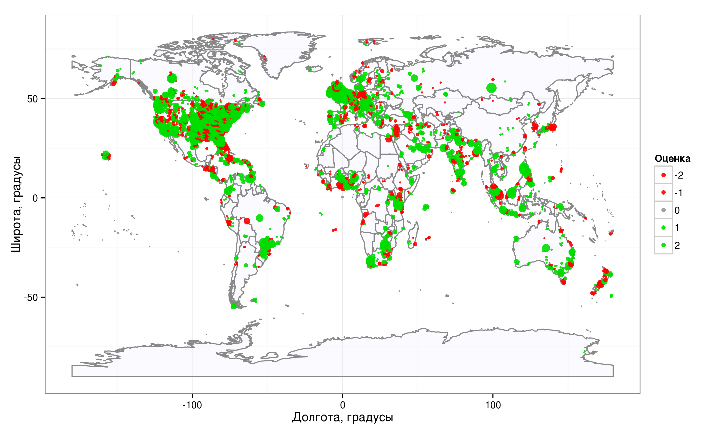
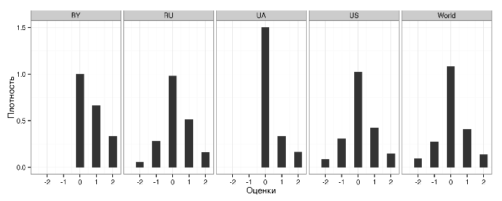

Отношение к высшему образованию: сентимент-анализ данных микроблогов
========================================================
**Гедранович Б.А, Гедранович А.Б**
**********************************

#### Аннотация
В статье проводится сентимент-анализ сообщений в микроблогах *Twitter*, относящихся к высшему образованию. Было агрегировано 42803 тематических сообщений, проведен описательный анализ и выявлено обобщенное эмоциональное восприятие темы --- большинство сообщений носит нейтральный характер, количество положительных отзывов превышает количество отрицательных. Существенных отличий в распределении эмоциональных оценок по странам не выявлено.

#### Annotation
Article describes sentiment-analysis of *Twitter* 

Введение
------------------
Ключевым моментом в ведении любого бизнеса является исследование целевой аудитории. Это позволяет лучше узнать потребителей, сфокусировать свои усилия на удовлетворение их нужд. При оценке отношения потребителей к сложным продуктам, таким как образовательные услуги, туристические услуги, автомобили и пр., зачастую более важным является не столько рациональное, сколько эмоциональное восприятие товара. В качестве примера можно привести такие категории, как "*престиж вуза*" или "*элитарность образования*", которые в большей степени отражают субъективную (эмоциональную) составляющую оценки, нежели объективную (рациональную).

Современным инструментом оценки эмоционального восприятия продукта является сентимент-анализ (*Sentiment Analysis*) (<a href="http://dx.doi.org/10.2200/S00416ED1V01Y201204HLT016">Liu, 2012</a> ). Основной задачей данного подхода является определение субъективного восприятия продукта на основе семантического разбора текста. Конечные методики, используемые в рамках сентимент-анализа, могут варироваться от сравнительно простого словарного разбора предложений до сложных эвристических алгоритмов.

Развитие глобальной сети Интернет и сервисов, которые в ней предоставляются, дает неограниченные возможности для сбора маркетинговых данных о выбранной предметной области. В частности, микроблоги --- сервисы, позволяющие публиковать в сети короткие сообщения с помощью как стационарных, так и мобильных устройств, являются наиболее популярным способом агрегирования текстовой информации. Наиболее популярным сервисом микроблогов заслуженно считают *Twitter* ( ), среди прочих достоинств которого можно отметить наличие программных интерфейсов (*Application Programming Interface --- API*), предоставляющих богатые возможности по автоматизации.

Данная работа призвана дать ответ на несколько вопросов:
* Как в целом потребители воспринимают высшее образование на эмоциональном уровне?
* Существует ли отличия в оценке высшего образования по странам?
* Как географически распределены положительные/отрицательные сообщения о высшем образовании?
* Какие географические регионы могут стать потенциальными рынками для экспорта белорусских образовательных услуг?

Мы рассматривали только англоязычную часть микроблогов, т.к., во-первых, охват большего количества языков является сложной технической задачей, выходящей за рамки нашего исследования, а во-вторых --- английский является основным языком академической среды *де факто*, следовательно, экспорт белорусских образовательных услуг нужно ориентировать на те регионы, где этот язык активно используется.

В первой части статьи приводится описание базовых техник, применяемых в сентимент-анализе, вторая часть посвящена вопросам, связанным со сбором и первичной обработкой данных, в третьей части описываются основные результаты и делаются выводы о проделанной работе.

1. Сентимент-анализ
------------------

Сентимент-анализ (анализ тональности) --- это раздел компьютерной лингвистики, в рамках которого изучается извлечение мнений и эмоциональной окрашенности текста. Как правило, с помощью анализа тональности выясняют отношение автора текста к рассматриваемой теме. Обычно такое отношение измеряют на простой шкале "положительное мнение" / "отрицательное мнение", более сложные системы предусматривают использование многоуровневой шкалы.

Анализ тональности нашел применение в различных областях: социология, политология, психология, медицина, маркетинг и др. В каждом конкретном случае могут ставиться отличные исследовательские или коммерческие задачи, однако используемый инструментарий чаще всего совпадает.

Подходы к классификации тональности можно разделить на следующие категории:
1. Использование набора "если-то" правил.
2. Словарный разбор предложений.
3. Машинное обучение с учителем.
4. Машинное обучение без учителя ( ).

Первый тип систем состоит из большого набора правил, применяя которые система делает заключение о тональности текста. Для надежной работы системы необходимо составить большое количество правил, которые, зачастую, привязаны к определенной предметной области, при смене которой требуется актуализировать базу правил. Тем не менее, этот подход, при условии наличия хорошей базы правил, относят к одному из самых точных.

Словарный разбор предложений требует наличия так называемых тональных словарей, содержащих слова с положительной и отрицательной тональностью, а часто и дополнительным весовым коэффициентом. При разборе предложения рассчитывается общее количество слов с различной тональностью и выводится итоговый показатель тональности, по которому можно оценить и общий эмоциональный фон текста. К примерам исследований в данном направлении можно отнести работу (<a href="http://jeffreybreen.wordpress.com/2011/07/04/twitter-text-mining-r-slides/">Breen, 2011</a> ). 

При машинном обучении с учителем требуется наличие заранее подготовленного корпуса текстовых документов с уже проведенной оценкой тональности, который используется для обучения классификационной модели. В рамках данного направления существует большое количество методов классификации, т.к. метод опорных векторов, деревья решений и пр., которые хорошо зарекомендовали себя на практике. К очевидным недостаткам обучения с учителем относится недоступность или отсутствие обучающей выборки во многих практических случаях (<a href="http://dx.doi.org/10.1561/1500000011">Pang & Lee, 2008</a> ).

Машинное обучение без учителя --- перспективный, но одновременно и наименее точный способ классификации текста. Вместе с тем его применение возможно в широком спектре приложений (<a href="">Isabelle & Turney, unknown</a> ).

В данном исследовании мы применяли словарный разбор предложений и их оценку по тональным словарям ( ). Это было обусловлено, во-первых, сравнительной простотой используемых запросов, а во-вторых --- интернациональностью используемых в поиске терминов.

К проблемам сентимент-анализа относят идентификацию иронии, использование локального или субкультурного сленга, сокращений, наличие грамматических ошибок и пр. Все это усложняет и без того не простые задачи по классификации текста. 
Также при проведении анализа тональности отдельно выделяют такое направление, как выявление географических отличий в лексиконе ( ). Действительно, одно и то же слово даже в рамках одной страны и одного языка может интерпретироваться двояко, что также усложняет анализ.

2. Данные
------------------
### Сбор данных
Служба микроблогов *Twitter* ( ) предоставляет несколько вариантов *API* для  доступа к данным. Первый из них --- это *Search API* ( ), который позволяет осуществлять поиск сообщений по заданному запросу. Особенностями поиска с помощью этого программного интерфейса является ограничение на количество результатов, возвращаемых на запрос (текущее ограничение --- 1500 сообщений), отсутствие информации о географических координатах в результатах поиска, ограничение на количество запросов за заданный временной интервал. Более того, *Search API* предоставляет доступ только к приблизительно 6-8% всех сообщений за последнюю неделю.

Второй способ доступа к данным микроблогов -- это *Streaming API* ( ), отличительной особенностью которого является принципильной иной способ взаимодействия со службами *Twitter*. С помощью *Streaming API* можно подключиться к потоку сообщений микроблогов в режиме реального времени и агрегировать сообщения по мере их поступления. Таким образом можно добиться большего охвата данных по выбранным ключевым словам. Кроме того, при таком подходе можно отслеживать были ли входящие сообщения геокодированы (т.е. пользовательское устройство явно сообщило долготу и широту местоположения пользователя в момент отправления сообщения).

На практике только около 1% всех сообщений в *Twitter* являются геокодированными. Вместе с тем местоположения пользователя можно оценить и по данным его профиля, который заполняется во время регистрации в службе *Twitter*. Конечно же, указанные пользователем данные могут отличаться от действительности, поэтому требуется дополнительный шаг --- валидация данных профиля. Простым и эффективным способом решения данной задачи является проверка корректности географических названий по базе данных одной из географических служб. Среди прочих сервисов лидирующее положение занимает *GeoNames* ( ), которая использовалась для определения географических координат по названию населенного пункта.

В настоящей работе использовалась комбинация двух *API*, предоставляемых службой *Twitter*, и внешнего сервиса *GeoNames* для получения информации о местоположении пользователя. Общий алгоритм сбора данных был следующим:

1. Подключение к потоку сообщений с помощью *Streaming API*, получение новых входящих сообщений по фильтру "*education,university,professor,college*".
2. Для каждого нового сообщения выделение следующих полей:
  * Идентификационный номер.
  * Дата и время создания.
  * Текст сообщения.
  * Язык сообщения.
3. Если сообщение геокодированное:
  * Выделение географических координат местоположения пользователя.
  * Запрос к службе _GeoNames_ для определения страны по географическим координатам.
4. Если сообщение не является геокодированным:
  * Выделение местоположения пользователя по данным, указанным в профиле (при необходимости, отправляется дополнительный запрос с помощью _Search API_).
  * Запрос к службе _GeoNames_ для распознавания местоположения пользователя.
  * Если распознавание прошло успешно --- выделение страны пользователя, и географических координат местоположения (города, штата, пр.).
5. Очистка текст сообщения от пунктуации, хэш-тэгов, удаление веб-ссылок, лишних пробелов, перевод в нижний регистр.
6. Если после всех манипуляций все необходимые поля заполнены корректно, сообщение регистрируется в базе данных.

Таким образом, в течение одной недели марта 2013 года было обработано и зарегистрировано 42803 сообщений микроблогов *Twitter* на английском языке, касающихся высшего образования. После регистрации была проведена оценка тональности всех сообщений по пятибалльной шкале от -2 до +2.

3. Результаты
------------------

Большую часть всех сообщений составляли нейтральные по отношению к высшему образованию сообщения, а среди эмоционально окрашенных отзывов преобладали положительные (Таблица 1.). При этом более 60% всех сообщений было сгенерировано пользователями США и Великобритании. Среди прочих стран с англоговорящим населением (Канада, Австралия) выделяются государства Юго-Восточной Азии: Филиппины, Индия, Малайзия, Индонезия, что может свидетельствовать о высокой плотности населения и, одновременно, наличия потенциальных рынков сбыта образовательных услуг в этом регионе.

**Таблица 1.** Распределение сообщений по странам

|        &nbsp;        |  positive  |  negative  |  neutral  |  total  |  percentage  |
|:--------------------:|:----------:|:----------:|:---------:|:-------:|:------------:|
|  **United States**   |    6147    |    4268    |   10972   |  21387  |    49,97     |
|  **United Kingdom**  |    1684    |    1030    |   2684    |  5398   |    12,61     |
|      **Canada**      |    481     |    313     |    920    |  1714   |     4,00     |
|      **Brazil**      |    200     |    127     |    974    |  1301   |     3,04     |
|   **Philippines**    |    279     |    169     |    791    |  1239   |     2,89     |
|      **India**       |    230     |    180     |    598    |  1008   |     2,35     |
|     **Malaysia**     |    133     |     69     |    456    |   658   |     1,54     |
|    **Indonesia**     |    121     |     53     |    457    |   631   |     1,47     |
|    **Australia**     |    180     |    120     |    322    |   622   |     1,45     |
|     **Tanzania**     |    163     |     84     |    346    |   593   |     1,39     |
|      **Other**       |    2138    |    1507    |   4607    |  8252   |    19,28     |
|   **World, total**   |   11756    |    7920    |   23127   |  42803  |    100,00    |

Типичные сообщения с положительной и отрицательной тональностью приведены в Таблице 2. Среди них можно выделить как относящиеся к образованию вообще, так и записи, которые носят частный характер. 

**Таблица 2.** Примеры положительных и отрицательных сообщений

|                                                        Positive                                                        |                                                            Negative                                                             |
|:----------------------------------------------------------------------------------------------------------------------:|:-------------------------------------------------------------------------------------------------------------------------------:|
|                                     She got good head, good brain, good education                                      |                     All I hear from my professor this morning is blah-blah-blah. Crazy psychology professor                     |
|            Education is a better safeguard of liberty than a standing armyedward everett hale quotesfolder             |                Life hack: if you're considering taking abnormal psychology in college - consider suicide instead                |
|             Interesting story. University hospital has among best cardiac arrest survival rates in region              |                     My management class was boring. Oh, hell! No! The professor even has really bad reviews                     |
| One of my best friends who I met through college just got an article published I'm so proud of this girl! It's unreal! |                      I hope Clemson University parking service employees have a nice time burning in hell                       |
|                             Wow! Just made a professor who never smiles smile! Haha I try                              | College makes me turn against what I loved. Year of cooking - started hating cooking. Now music college is making me hate music |

Для наглядного представления частотного распределения слов, а также их взаимосвязи используют структуру "облако тегов" (*tags cloud*) (Рисунки 1 и 2). Наиболее часто встречающиеся слова размещают в середине и делают их более крупными, слова, связанные с ними, и появляющиеся в тексте немного реже, размещают по окружности от высокочастотных --- и так далее до внешней границы облака. На рисунках визуализированы два набора терминов: отдельно для положительных и отрицательных высказываний, которые встречались в тексте как минимум 50 раз.

 

**Рисунок 1.** Облако тегов для положительных сообщений

 

**Рисунок 2.** Облако тегов для отрицательных сообщений

Можно отметить, что слова, находящиеся в центре облака, являются, в основном, общеупотребляемыми, а абсолютное большинство слов текста не входят в словари тональности. Это может свидетельствовать о том, что выборка не была узко направленной и специфичной.

Распределение плотности оценок по странам со сравнительно высоким количеством сообщений слабо отличалось от общемирового распределения, что вполне предсказуемо в связи с доминирующим положением США (рисунок 3.). Большинство стран с достаточным количеством наблюдений, например, Россия (509 сообщений) имеют распределение плотности оценок мало отличающееся от мирового, а для стран с небольшим количеством наблюдений, т.к. Украина (12 сообщений) и Беларусь (6 сообщений) могут преобладать наблюдения с определенным типом тональности.

 

**Рисунок 3.** Плотность распределения оценок по выбранным странам

На рисунке 4. отображены только сообщения с положительной или отрицательной тональностью. Можно отметить, что в целом большее количество сообщений в Twitter исходило от пользователей из экономически активных регионов: США, Западной Европы, стран Карибского бассейна, восточного побережья Австралии, Юго-Восточной Азии, Индии, Юго-Восточного побережья Бразилии, Южной Африки, Западного побережья экваториальной Африки и некоторых других.

 

**Рисунок 4.** Карта распределения сообщений

Какие из этих регионов могут стать потенциальными рынками сбыта для белорусских образовательных услуг? Ответ на этот вопрос следует искать применительно к форме предоставления таких услуг. Если речь идет о дистанционном образовании, то, при должной организации, в любой из стран данных регионов можно конкурировать с локальными поставщиками услуг. Это может быть как ценовая конкуренция, так и нишевая конкуренция. Однако при предоставлении услуг традиционным способом существенными становятся вопросы географической близости и насыщенности местного рынка образования. В таком случае, основное внимание целесообразно уделить Юго-Восточной Азии, где наблюдается высокая плотность населения и сравнительно небольшое количество университетов на 1000 населения.

На рисунках 4 и 5 заметно, что отрицательные сообщения сконцентрированы в нескольких "очагах", а в остальном они распределены равномерно и уступают положительным заметкам. Можно предположить, что такие явления связаны с локальными и/или временными событиями --- однако сделать достоверные выводы станет возможным только после проведения более масштабного исследования.

 

**Рисунок 5.** Карта распределения сообщений для США

Заключение
------------------

Использование данных микроблогов Twitter становится мощным инструментом современного маркетинга, позволяющем за сравнительно короткий промежуток времени агрегировать большие объемы информации о потребителях. Одним из очевидных направлений использования таких сведений является сентимент-анализ или анализ тональности.

Проведенное исследование показало, что в целом, отношение к высшему образованию положительное, большинство обнаруженных "очагов" отрицательных отзывов следует связывать с локальными или временными событиями. При этом распределение плотности оценок тональности сообщений мало отличается для стран с достаточным количеством наблюдений. При таргетировании белорусских образовательных услуг, предоставляемых на английском языке, следует обратить внимание на страны Юго-Восточной Азии.

Среди направлений дальнейших исследований можно выделить анализ сообщений в микроблогах на языках, отличных от английского и сопоставление результатов с полученными в данной работе, сравнение эмоциональных оценок сообщений о высшем образовании с рейтингами университетов по странам, а также долгосрочные исследования, позволяющие нивелировать эффект локальных и временных событий.

Анализ был проведен на базе платформы *R* ( ), использовались пакеты *RCurl* (<a href="http://CRAN.R-project.org/package=RCurl">Lang, 2013</a> ), *RJSONIO* (<a href="http://CRAN.R-project.org/package=RJSONIO">Lang, 2013b</a> ) для агрегации данных от веб-служб *Twitter* и *GeoNames*, *ggplot2* (<a href="http://had.co.nz/ggplot2/book">Wickham, 2009</a> ), *wordcloud* (<a href="http://CRAN.R-project.org/package=wordcloud">Fellows, 2012</a> ), *rworldmap* (<a href="http://CRAN.R-project.org/package=rworldmap">South _et. al._ 2012</a> ) --- для визуализации результатов, *plyr* (<a href="http://www.jstatsoft.org/v40/i01/">Wickham, 2011</a> ), *stringr* (<a href="http://CRAN.R-project.org/package=stringr">Wickham, 2012</a> ), *data.table* (<a href="http://CRAN.R-project.org/package=data.table">Dowle _et. al._ 2013</a> )--- для общей и статистической обработки данных, *tm* (<a href="http://CRAN.R-project.org/package=tm">Feinerer & Hornik, 2013</a> ; <a href="http://www.jstatsoft.org/v25/i05/">Feinerer _et. al._ 2008</a>  ) --- для семантического анализа текста, *pander* (<a href="http://cran.r-project.org/package=pander">Daróczi, 2013</a> ) --- для подготовки текста статьи. Исходный программный код, использованный при написании статьи доступен по адресу ( ).

Литература
--------------

- R Core Team ,   (2013) R: A Language and Environment for Statistical Computing.  [http://www.R-project.org/](http://www.R-project.org/)
- Gergely Daróczi,   (2013) pander: An R Pandoc Writer.  [http://cran.r-project.org/package=pander](http://cran.r-project.org/package=pander)
- M Dowle, T Short, S Lianoglou,   (2013) data.table: Extension of data.frame for fast indexing, fast ordered joins,
fast assignment, fast grouping and list columns..  [http://CRAN.R-project.org/package=data.table](http://CRAN.R-project.org/package=data.table)
- Ingo Feinerer, Kurt Hornik, David Meyer,   (2008) Text Mining Infrastructure in R.  *Journal of Statistical Software*  **25**  (5)   1-54  [http://www.jstatsoft.org/v25/i05/](http://www.jstatsoft.org/v25/i05/)
- Ingo Feinerer, Kurt Hornik,   (2013) tm: Text Mining Package.  [http://CRAN.R-project.org/package=tm](http://CRAN.R-project.org/package=tm)
- Ian Fellows,   (2012) wordcloud: Word Clouds.  [http://CRAN.R-project.org/package=wordcloud](http://CRAN.R-project.org/package=wordcloud)
-  Twitter.  [http://twitter.com/](http://twitter.com/)
-  Using the Twitter Search API.  *@twitterapi*  [https://dev.twitter.com/docs/using-search](https://dev.twitter.com/docs/using-search)
-  GeoNames.  [http://geonames.org/](http://geonames.org/)
-  the Twitter Streaming APIs.  *@twitterapi*  [https://dev.twitter.com/docs/streaming-apis](https://dev.twitter.com/docs/streaming-apis)
- Jacob Eisenstein, Brendan O'Connor, Noah Smith, Eric Xing,  A latent variable model for geographic lexical variation.  *Proceedings of the 2010 Conference on Empirical Methods in Natural Language Processing*  [http://dl.acm.org/citation.cfm?id=1870782](http://dl.acm.org/citation.cfm?id=1870782)
-  Обучаем компьютер чувствам (sentiment analysis по-русски).  *Хабрахабр / Комментарии к посту «Обучаем компьютер чувствам (sentiment analysis по-русски)»*  [http://habrahabr.ru/post/149605/](http://habrahabr.ru/post/149605/)
-  redmode,  twitter-sentiment-education.  *GitHub*  [https://github.com/redmode/twitter-sentiment-education](https://github.com/redmode/twitter-sentiment-education)
- Jeffrey Breen,   (2011) slides from my R tutorial on Twitter text mining #rstats.  *Things I tend to forget*  [http://jeffreybreen.wordpress.com/2011/07/04/twitter-text-mining-r-slides/](http://jeffreybreen.wordpress.com/2011/07/04/twitter-text-mining-r-slides/)
-  .  [http://www.cs.uic.edu/~liub/FBS/opinion-lexicon-English.rar](http://www.cs.uic.edu/~liub/FBS/opinion-lexicon-English.rar)
- Duncan Lang,   (2013) RCurl: General network (HTTP/FTP/...) client interface for R.  [http://CRAN.R-project.org/package=RCurl](http://CRAN.R-project.org/package=RCurl)
- Duncan Lang,   (2013) RJSONIO: Serialize R objects to JSON, JavaScript Object Notation.  [http://CRAN.R-project.org/package=RJSONIO](http://CRAN.R-project.org/package=RJSONIO)
- Bing Liu,   (2012) Sentiment Analysis And Opinion Mining.  *Synthesis Lectures on Human Language Technologies*  **5**  1-167  [10.2200/S00416ED1V01Y201204HLT016](http://dx.doi.org/10.2200/S00416ED1V01Y201204HLT016)
- Bo Pang, Lillian Lee,   (2008) Opinion Mining And Sentiment Analysis.  *Foundations And Trends® in Information Retrieval*  **2**  1-135  [10.1561/1500000011](http://dx.doi.org/10.1561/1500000011)
- Andy South, with Scutt-Phillips, Barry Rowlingson, Roger Foster,   (2012) rworldmap: Mapping global data, vector and raster..  [http://CRAN.R-project.org/package=rworldmap](http://CRAN.R-project.org/package=rworldmap)
- Pierre Isabelle, Peter D. Turney,   (unknown) Thumbs up or Thumbs Down?.  *Unknown*
- Hadley Wickham,   (2009) ggplot2: elegant graphics for data analysis.  [http://had.co.nz/ggplot2/book](http://had.co.nz/ggplot2/book)
- Hadley Wickham,   (2011) The Split-Apply-Combine Strategy for Data Analysis.  *Journal of Statistical Software*  **40**  (1)   1-29  [http://www.jstatsoft.org/v40/i01/](http://www.jstatsoft.org/v40/i01/)
- Hadley Wickham,   (2012) stringr: Make it easier to work with strings..  [http://CRAN.R-project.org/package=stringr](http://CRAN.R-project.org/package=stringr)

